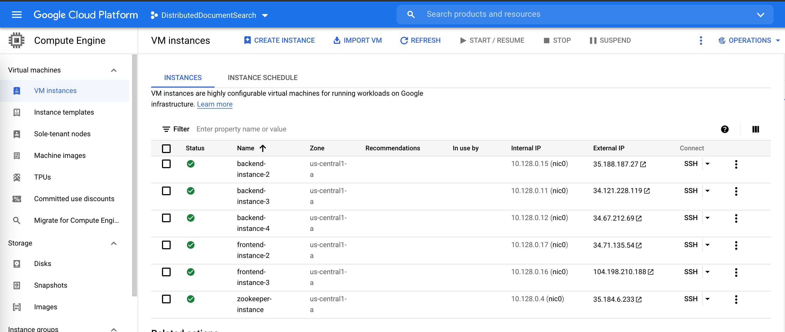

# Distributed Document Search - DS Final Project User Guide

## Project structure

This project has three components (see design in executive summary):

* Document search backend server (including a commandline client), implemented as a Java Maven project.
* Document search frontend server, implemented as a Spring Boot project.
* ZooKeeper server, a container deployed on a remote VM instance.

### Document Search Backend Server

```bash
distributed-document-search-backend
├── dockerfile
├── pom.xml
├── src
│    ├── main/
│        ├── java/
│        │   ├── com/ds/documentsearch/
│        |       ├── DocumentSearchBackendServer.java
│        |       ├── DocumentSearchClient.java
│        |       ├── OnElectionAction.java
│        │       ├── cluster/
│        │       │    ├── LeaderElection.java
│        │       │    ├── OnElectionCallback.java
│        │       │    ├── ServiceRegistry.java
│        │       ├── service/
│        │       |    ├── CoordinatorServiceImpl.java
│        │       |    ├── WorkerServiceImpl.java
│        │       ├── utils/
│        │            ├── Tokenizer.java
│        ├── proto/
│        │   ├── DocumentSearchCoordinator.proto
│        │   ├── DocumentSearchWorker.proto
│        ├── resources/
│            ├── log4j.properties
├── target
     ├── document-search-backend-server-jar-with-dependencies.jar
     ├── document-search-client-jar-with-dependencies.jar    
```

### Document Search Frontend Server

```bash
distributed-document-search-frontend
├── dockerfile
├── pom.xml
├── src
│    ├── main/
│        ├── java/
│        │   ├── com/ds/documentsearch/
│        |       ├── DistributedDocumentSearchFrintendApplication.java
│        |       ├── CoordinatorChannelManager.java
│        |       ├── SearchController.java
│        │       ├── cluster/
│        │            ├── ServiceRegistry.java
│        ├── proto/
│        │   ├── DocumentSearchCoordinator.proto
│        ├── resources/
│            ├── application.properties 
│            ├── static/
│                 ├── index.html
│            ├── templates/
│                 ├── search.html
├── target
     ├── distributed-document-search-frontend-0.0.1-SNAPSHOT.jar
```


## Deployment

This project is already deployed on Google Cloud Platform. For each of the three componenets, we have the following set up:

* Three VM instances for backend server containers.
* Two VM instances for frontend server containers.
* One VM instance for a ZooKeeper server container.



Due to the fact that this project relies on Apache ZooKeeper, local testing will require bringing up local ZooKeeper instance. It is recommended to
directly test remotely. Frontend servers can be accessed via either of the following url:

* http://34.71.135.54:8081/
* http://104.198.210.188:8081/

## Testing

The system was tested in the following scenario:

### All 3 backend instances up running

Frontend send the request to coordinator and two workers shared the work.


### One worker instance went down

The worker that was left alone handled all the work.


### Old worker instance joined back

The worker joined back and continued as worker, which was detected by the coordinator.


### Coordinator instance went down

Another worker got elected as the new leader. The other worker handled all the work.


### Old coordinator instance joined back

The old coordinator is now elected as worker, which was detected by the new coordinator.
